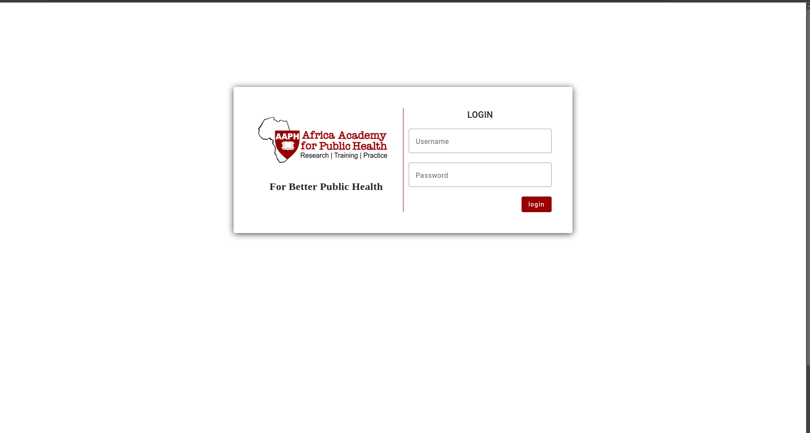
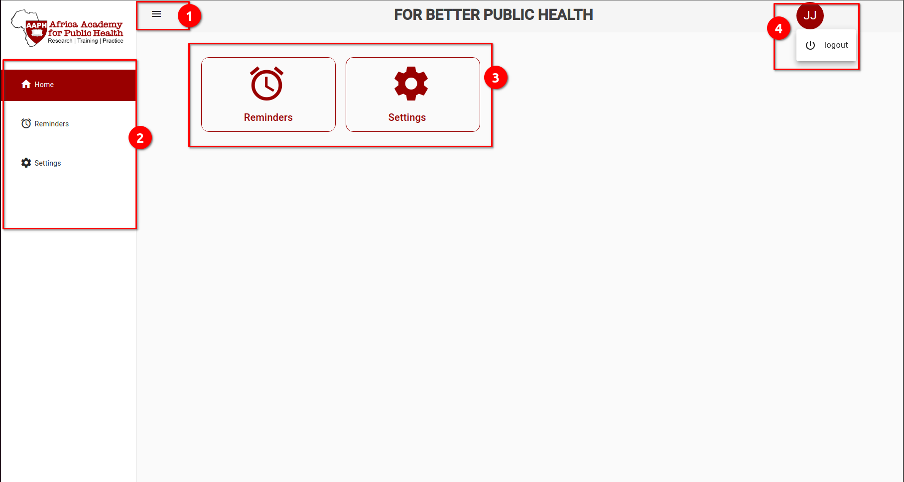

# System Features / Modules
User will be required to login before continuing to use the system. The user account will be provided by the system administrator hence no user will be required to register themselves. The following is the image showing the login page.

After successiful login attempt. The system will redirect you to the main page that lists all the modules. This is the starting point of user's navigation to the system. Modules will be shown in tiles that after being clicked they'll take you to the particular module.

From the image:
 - ** User Info **   
    On the top right, the red circle with letters, is the initial button which upon clicking will show more user options. These options will be more likely used to affect user's profile and to logout.

 - ** Menu **  
    The humburger symbol on the top left side of the image, is clickable option to **show** or **hide** the side menu which lists system modules as selections.

 - ** Side Menu **  
    As explained on previous point. This will list all the modules as options that user can select from. Based on access rights, users might differ on what modules they can see and act upon.

This system contains the following modules (features):
 - **Reminder**
 - **Settings**

## 1. Reminder
This feature is used to set specific reminders for long term basis. Based on the nature of the particular issue, there can be a reminder to remind particular users via email. The reminder feature supports emails. Privileged user can add reminders as per organizations needs. [Click here to start with **Reminder** module](/user/user-manual-reminder).

## 2. Settings
This feature is set ready to handle system settings. These settings will affect the whole system and will cascade into every module in particular.
This module has users, roles and privileges management. We expect to set all these for settings and will definitely affect user in every thing they touch within the system.