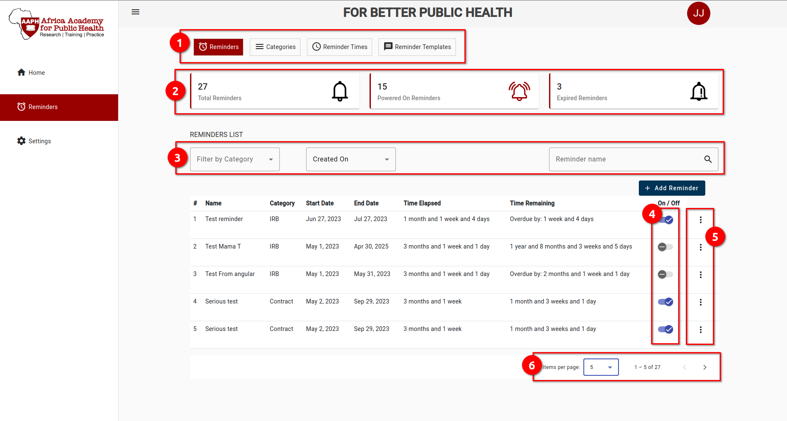

# Reminder
Reminder module, handles all the matters related to reminders. User, will be able to set a reminder and make it easy for the system to reminder them as per settigns. This module involves some of its own configurations that will be powered by the following features:

 

 From this image, there are common and specific features across the module. We will go over common features across the module then we will be specific with features for the first page.

 #### Common Features
 These are features that you are more likely to find in sub sections of the module of even other modules.
- **Menu Bar** (***Marked Number 1 ***)  
  This shows all the sub sections inside a module which complement and work together to complete a module. Each subsection will have some more or extended functionalities that will help to achieve the whole module's purpose. navigating through them will open different pages accordingly.
- **Data Filters** (***Marked Number 3 ***)  
  These are helpfull when in need to see data based on some requirements. You are more likely to use this when searching for a certain kind of data or a specific data.
  
- **More ** (***Marked Number 5 ***)  
- **Paginator** (***Marked Number 6 ***)

###  Reminders
This is the main feature, as it is the heart of this module. This feature allows user to set reminders, turning them on or off depending on the needs as well as updating/removing a particular email. Upon opening of this module, you'll be presented with selection menu on top of the page right after the top bar of the system. These menu will change depending on the module. In this module, these menu includes:
  - Reminders
  - Categories
  - Reminder Times
  - Reminder Templates

From this image we can see we have some dashboard like summaries for reminders statuses which are: 
  - ** Total number of reminders **
  - ** Number of powered of reminders ** 
  - ** Expired reminders (Overdue reminders since the last date) **

### &nbsp; &nbsp; &nbsp; Cagetories

###  &nbsp; &nbsp; &nbsp; Reminder Times
###  &nbsp; &nbsp; &nbsp; Reminder Templates